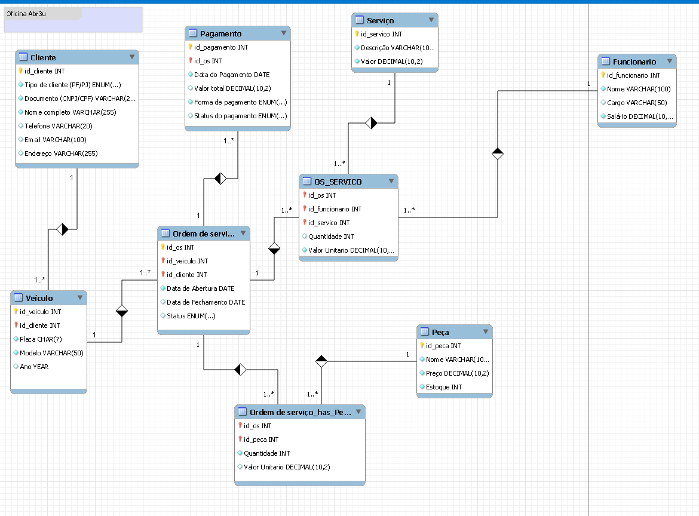

# 🚗 Desafio DIO -- Banco de Dados Oficina

Este projeto faz parte de um **desafio da Digital Innovation One (DIO)**
e tem como objetivo modelar, criar, popular e consultar um banco de
dados para gerenciamento de uma **oficina mecânica**.

O sistema contempla clientes (pessoa física e jurídica), veículos,
funcionários, serviços, peças, ordens de serviço e pagamentos.

------------------------------------------------------------------------

------------------------------------------------------------------------

## 📂 Estrutura do Projeto

O repositório contém três arquivos principais:

-   **`BD oficina.sql`** → Script responsável pela **criação do banco de
    dados e tabelas**.\
-   **`Alimentado BD.sql`** → Script para **popular o banco** com dados
    fictícios (clientes, veículos, serviços, funcionários, ordens de
    serviço, etc.).\
-   **`Consultas BD.sql`** → Conjunto de **consultas SQL** para análise
    e manipulação das informações do banco.

------------------------------------------------------------------------

## 🛠️ Estrutura do Banco

O banco de dados é criado com o nome `oficina_abr3u` e contém as
seguintes tabelas:

-   **cliente** → Cadastro de clientes (pessoa física/jurídica).\
-   **veiculo** → Informações dos veículos vinculados aos clientes.\
-   **funcionario** → Funcionários da oficina, cargos e salários.\
-   **servico** → Serviços oferecidos pela oficina.\
-   **peca** → Peças disponíveis em estoque.\
-   **ordem_servico** → Registro das ordens de serviço (com status e
    prazos).\
-   **os_servico** → Associação de serviços prestados dentro de cada
    OS.\
-   **os_peca** → Peças utilizadas em cada OS.\
-   **pagamento** → Controle de pagamentos (valor, forma e status).

------------------------------------------------------------------------

## 📊 Exemplos de Consultas

O arquivo `Consultas BD.sql` contém diversos exemplos práticos, como:

-   Listar descrição e valor de todos os serviços.\
-   Filtrar funcionários com salário acima de R\$ 3.000.\
-   Exibir clientes que são **Pessoa Jurídica**.\
-   Calcular preço das peças com desconto de 10%.\
-   Calcular a duração (em dias) de ordens de serviço fechadas.\
-   Listar veículos do mais novo para o mais antigo.\
-   Identificar clientes com mais de um veículo.\
-   Descobrir quais funcionários participaram de mais de uma OS.\
-   Obter o valor total de cada OS, incluindo serviços e peças.

------------------------------------------------------------------------

## ▶️ Como Executar

1.  Clone este repositório ou copie os arquivos `.sql`.\
2.  Execute o script `BD oficina.sql` para criar o banco e suas
    tabelas.\
3.  Execute o script `Alimentado BD.sql` para inserir os dados
    iniciais.\
4.  Rode as consultas em `Consultas BD.sql` para explorar os resultados.

------------------------------------------------------------------------

## 🚀 Tecnologias Utilizadas

-   **MySQL** (versão 8+ recomendada).\
-   Scripts SQL puros para **DDL, DML e DQL**.

------------------------------------------------------------------------

## 📌 Autor

Desenvolvido como parte de um desafio da **Ruan de Abreu Santos de Paula**.
